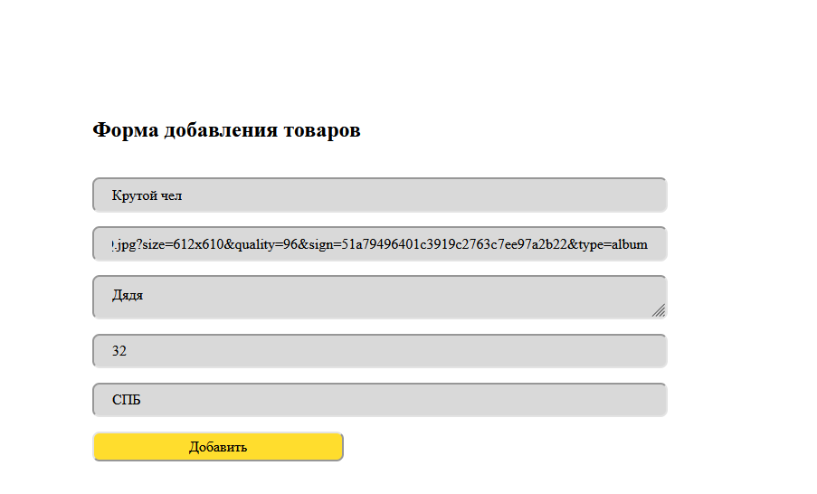
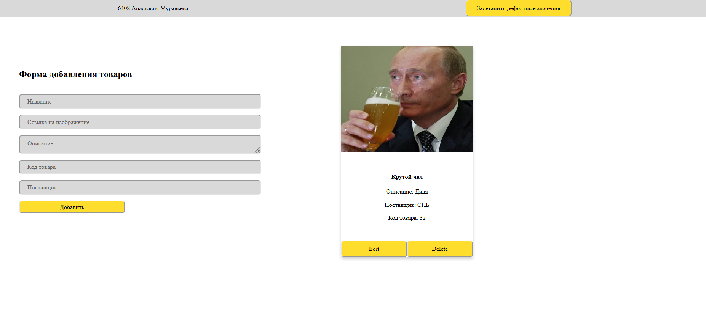
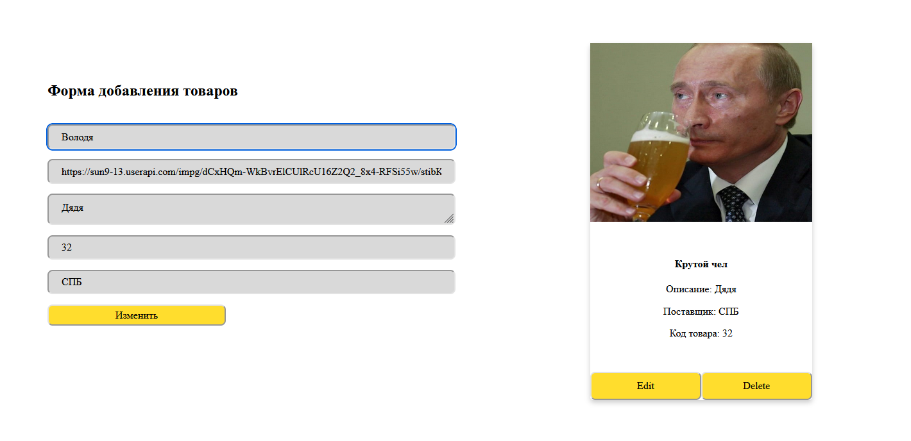
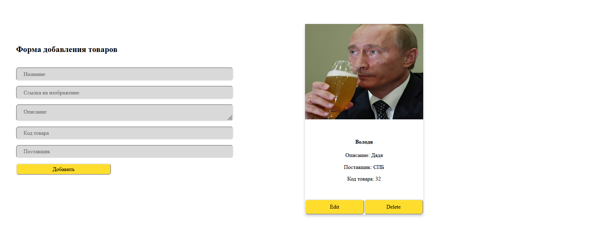
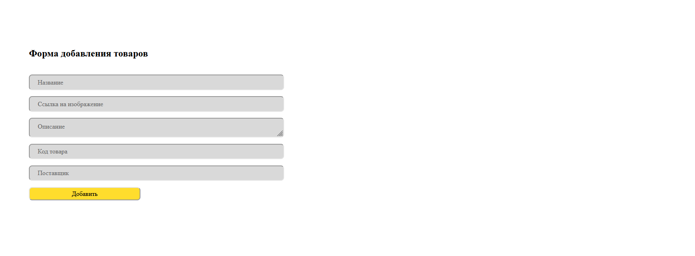
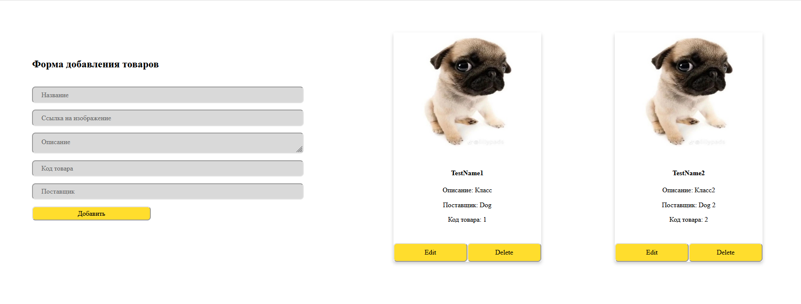

Было разработано приложение админки карточек с возможностью добавления, редактирования и удаления.

Добавление происходит с помощью формочки которая изображена снизу, при нажатии кнопки добавить будет помещен на странице соответствующий товар, а также обновлен localStorage:

Редактирование происходит при нажатии соответсвующей кнопки на карточке и в формочке отобразятся пресеты для редакта:

При нажатии кнопки удалить карточка удалится (ого):
 

Также при нажатии кнопки "Засетапить дефолтные значения" появятся две крутые карточки:

А, ну и при обновлении страницы все остается, так как из localStorage подгружается.

ЗАПУСК СЕРВЕРА - json-server --watch db.json